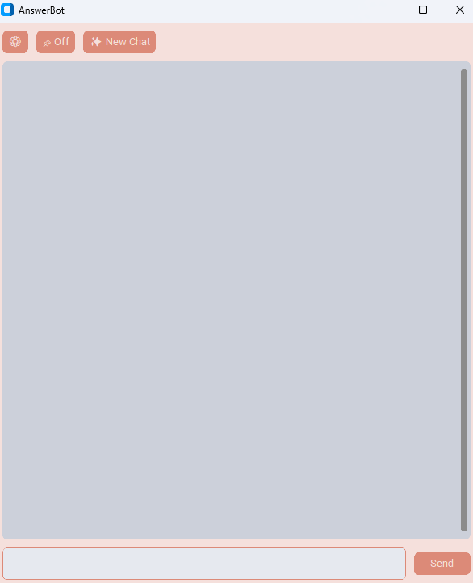

# AnswerBot
An all-in-one modern Python AI-Chat GUI with a system prompt designed for answering questions effectively. Basically a cheating tool.

## Advanced Features

- Support for Ollama, the OpenAI API, and the Google Gemini API
- API Endpoint Override Option
- Option to pin the window to the top of your screen (always on top)
- Chat History
- Advanced System Prompt to get perfected and concise/straight-to-the-point responses
- UI Designed around the System Prompt, Answer Highlighting, Code Boxing, Multiple Choice Boxing, and more
- Supports a wide range of questions from multiple choice to short answer to long answer to math problems

## Themes

<table>
  <tr>
    <td align="center">
      <br/>
      <b>Mocha</b>
    </td>
    <td align="center">
      <br/>
      <b>Mocha Dark</b>
    </td>
    <td align="center">
      <br/>
      <b>Fluent</b>
    </td>
    <td align="center">
      <br/>
      <b>Fluent Dark</b>
    </td>
  </tr>
</table>

## Setup Guide

Requirements: Python 3.11+ (Tested on Python 3.13.2), Git
1. Clone the GitHub Repo
```console
git clone https://github.com/WendellTech/AnswerBot.git
```

2. CD Into the Cloned Repo
```console
cd AnswerBot
```

3. Install Requirements
```console
pip install -r requirements.txt
```

4. Run the App
```console
python App.py
```

## Configuration Guide

Once your app is up and running, you will need to configure the API provider and choose a model. More advanced models provide more accurate answers and better results. Follow these steps to configure your settings:

1. **Click the Settings Button**
2. **Select an API Type**:
   - **OpenAI API**: Paid service, no free option available.
   - **Ollama**: Runs offline on your own device. Requires a powerful GPU.
   - **Google Gemini**: Offers free models. Recommended if you're just starting out.
   
> **Note**: This is not a guide on how to set up Ollama. Look elsewhere for that.
>
> For the purposes of this tutorial, I will be using the Gemini API.

3. **Log in with a Google account** on [AI Studio](https://aistudio.google.com/).
4. **Create an API key**:
   - Click on **"Get API key"**.
   - Select **"Create API key"**.
   - Choose **"Create API key in new project"**.
   - Once created, click **"Copy"** to copy your API key.
5. **Paste the API key**:
   - Go to the **App Settings** and paste the API key into the **API Key** box.
> Now you need to select an AI model. The best free model currently available for the Gemini API is `gemini-2.5-flash-preview-04-17`, with a limit of about `15-20 requests per minute`. For a full list of available AI models for each API, just search for them, for example you can search "Gemini API Model List" online.
6. **Enter the model name** you want to use into the **Model Name** box. (For example, if you're using `gemini-2.5-flash-preview-04-17`, enter that model name in the box.)
7. **Pick a theme** that you like from the options shown above.
8. **Adjust the rate limit**:
   - If you're using the model mentioned above, I recommend setting the rate limit to **4 or 5 seconds**. This will help prevent hitting the 15-20 requests per minute limit.
9. **Click Save** to save your settings.
10. **Test the AI** by sending a message and waiting for a response. You can ask a short or long-answer question, coding-related queries, or even math problems. You can also instruct the AI to shorten or lengthen its answers.
11. **Pin the window** to keep it always on top by clicking the little **pin icon**. To start a new chat, simply press the **New Chat** button.
12. Click Save
13. Send a message to the AI and wait for a response, it can be a short answer question, long answer question, coding question, a question that requires writing code, a multiple choice question, or a math question/math problem. You can also tell the AI to shorten or lengthen the previous long/short answer.
14. To keep the window always above everything else, click the little pin icon. To start a new chat press the New Chat button.

Enjoy! :D
